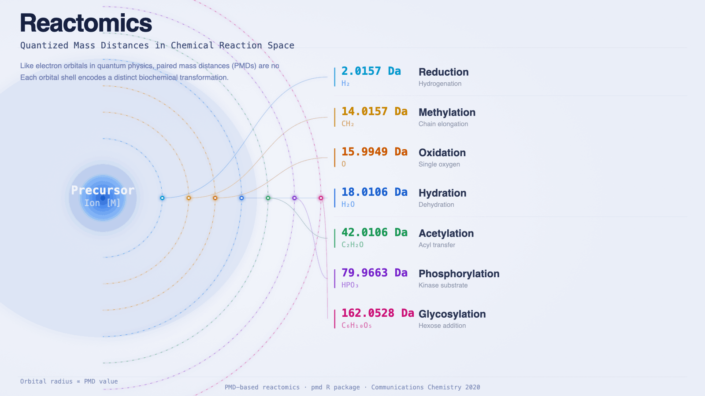

# Reactomics

**Reactomics** is the study of chemical reactions as a system — specifically, using **paired mass distances (PMDs)** observed in mass spectrometry data to identify and map the reaction networks operating in biological, environmental, and chemical systems. The concept was formally introduced in ["Reactomics: using mass spectrometry as a chemical reaction detector"](https://doi.org/10.1038/s42004-020-00403-z) (Communications Chemistry, 2020), where it was shown that the mass differences between pairs of ions in a metabolomics dataset directly encode the chemical reactions that connect them.

The core insight is simple but powerful: **a fixed mass difference between two molecules corresponds to a specific chemical reaction or biotransformation**. By cataloguing these paired mass distances across an untargeted metabolomics dataset, one can reconstruct the reaction networks active in a sample without prior knowledge of compound identities.

<figure>
  
  <figcaption>
    Like electron orbitals in quantum physics, paired mass distances are not continuous — they are quantized. Each orbital shell encodes a distinct biochemical transformation.
  </figcaption>
</figure>

## Where the quantization comes from

The orbital analogy above is more than a teaching aid. It has the same logical structure as the physics it borrows from: in both cases, a continuous space is forced into discrete units by a universal underlying constraint.

In quantum mechanics the constraint is the Schrödinger equation. Any bound electron must occupy one of a countable set of eigenstates, and because the equation is universal, every atom in the universe shares the same orbital architecture.

In metabolism the constraint is the **early cofactor budget**. Almost every reaction in living chemistry is driven by transferring a specific group from a small set of cofactors that were already in use before LUCA. Each cofactor delivers a fixed mass increment — and that increment is the PMD:

| Cofactor (or oxidant) | Group transferred | PMD (Da) | Reaction class |
|------------------------|-------------------|----------|----------------|
| NAD(P)H | H₂ | 2.0157 | Reduction |
| SAM | CH₂ (methyl) | 14.0157 | Methylation |
| O₂ / Fe–O / cytochromes | O | 15.9949 | Oxidation |
| (same systems) | OH | 17.0027 | Hydroxylation |
| (same systems) | H₂O | 18.0106 | Hydration / dehydration |
| Acetyl-CoA | C₂H₂O | 42.0106 | Acetylation |
| ATP / kinases | HPO₃ | 79.9663 | Phosphorylation |
| UDP-glucose | C₆H₁₀O₅ | 162.0528 | Glycosylation |

The PMDs that dominate real datasets are exactly the ones the cofactor-and-enzyme infrastructure can deliver cheaply. PMDs that would be chemically interesting but require unavailable cofactors or higher activation barriers simply do not appear at high frequency. The discreteness is not arbitrary — it is the shadow of which transformations early life could afford.

### Why mass spectrometry can read the shells

There is another layer of physical quantization at work, easy to miss but essential. The PMDs we count are not integer masses — they sit at very specific fractional values that disambiguate chemically distinct changes that share the same nominal mass. Methylation (+CH₂) has PMD 14.0157 Da; replacing carbon with nitrogen (+N) has PMD 14.0031 Da; an isotope swap gives yet a different value. These small offsets do not come from organic chemistry — **they come from nuclear binding energy**.

When nucleons bind into a nucleus, energy is released, and through E = mc² that energy registers as a mass deficit. Carbon-12 is exactly 12 by convention; every other nuclide carries a mass defect that reflects how tightly its nucleons are bound. Hydrogen-1 is 1.00783 Da, oxygen-16 is 15.9949 Da, nitrogen-14 is 14.0031 Da. These fractional offsets are quantum-mechanical observables — they encode the eigenstates of the strong force the way electronic orbitals encode the eigenstates of the Coulomb potential.

The consequence is direct: **the same physical quantization that gives atoms their discrete energy levels also gives molecular reactions their discrete mass signatures.** Without it, PMD shells would collapse into each other on the integer-mass axis and reactomics would be impossible. High-resolution mass spectrometry (Orbitrap, FT-ICR) is essentially a nuclear-binding-energy detector dressed up as a chemistry tool — it reads out chemistry by measuring how nucleons are arranged.

So the orbital picture is **doubly grounded** in physics. The shells exist because cofactor inheritance fixed which transformations early life could perform; the shells are observable because nuclear binding gives every transformation its own characteristic, quantum-mechanically distinct mass defect. Quantization at the electronic level made the chemistry possible; quantization at the nuclear level made it readable.

### The evolutionary freeze

Once a cofactor became central to cellular metabolism, it became almost impossible to remove. Every downstream pathway came to depend on it; the cofactor was now infrastructure, not a choice. This is the same logic that froze the genetic code in place — local mutations cannot rewire it because the entire cell now reads it.

The consequence is striking. The high-frequency PMD spectrum is **deeply conserved across all domains of life**. A bacterium, a plant, and a human share roughly the same set of dominant PMDs because they share roughly the same cofactors. What differs between organisms is not the *structure* of the spectrum but the *intensity* of each shell — which reactions are upregulated, which are suppressed.

This is a strong parallel to physics. Every atom shares the same orbital structure because every atom obeys the same Schrödinger equation; every organism shares the same PMD shell structure because every organism inherited the same frozen cofactor set. **Universality through a common underlying constraint** is the same explanatory move in both fields.

### A note for chemists

The take-home is not that metabolism is *like* quantum mechanics in some loose poetic sense. It is that **chemistry has its own genuine quantization principle**, derivable from cofactor inheritance and evolutionary lock-in. Chemists do not need to borrow the prestige of physics to make this argument — the discreteness of the metabolic reaction set is a phenomenon in its own right, with its own physical mechanism (cofactor-bounded catalytic feasibility) and its own conservation law (evolutionary freeze).

If physics gets to say "every atom in the universe has discrete energy levels because the Schrödinger equation is universal," chemistry gets to say "every cell on Earth has discrete reaction levels because the cofactor pool is universal." The shapes of those two statements are the same, and so is their explanatory weight.

## Why reactomics matters

Traditional metabolomics workflows identify compounds and correlate their abundance with phenotypes. This approach is valuable, but it treats metabolites as independent entities rather than as nodes in a reaction network. In reality, metabolites are produced, consumed, and transformed by enzymes and spontaneous chemistry — they are connected by reactions.

Reactomics addresses this gap by treating **reactions as first-class objects**. Rather than asking "which metabolites differ between groups?", reactomics asks "which reactions differ between groups?" and "what reaction network is active in this sample?". This shift has several practical consequences:

- Reaction-based analysis is **more robust to annotation gaps** than compound-based analysis, because PMDs can be computed for any peak pair regardless of whether the peaks have been annotated.
- Reactions are **chemically interpretable** — a PMD of 2.0157 (H₂) means reduction; a PMD of 14.0157 (CH₂) means methylation or chain elongation. The network is readable without a lookup table.
- Reaction networks can be **compared across conditions**, across species, and across sample types in a way that metabolite lists often cannot.
- The approach connects naturally to **biochemical pathway databases** (KEGG, HMDB reactions, Reactome) while remaining usable when compound annotation is incomplete.

## Paired mass distance and chemical reactions

### The PMD concept

A **paired mass distance (PMD)** is the absolute difference in accurate mass between two ions detected in the same mass spectrometry dataset. For example:

| PMD (Da) | Formula change | Reaction type |
|----------|----------------|---------------|
| 2.0157   | H₂             | Reduction / hydrogenation |
| 14.0157  | CH₂            | Methylation, chain elongation |
| 15.9949  | O              | Oxidation (single oxygen) |
| 17.0027  | OH             | Hydroxylation |
| 18.0106  | H₂O            | Hydration / dehydration |
| 28.0313  | C₂H₄           | Ethylation |
| 42.0106  | C₂H₂O          | Acetylation |
| 79.9663  | HPO₃           | Phosphorylation |
| 162.0528 | C₆H₁₀O₅        | Hexose addition (glycosylation) |

When two ions have a PMD matching a known reaction, they are candidates for a substrate–product pair of that reaction. When many such pairs are found in a dataset, the reaction is inferred to be active in the biological or chemical system under study.

### PMD network

Ion pairs connected by chemically meaningful PMDs form a **PMD network**. Nodes are ions (detected m/z values); edges are labeled by the PMD (i.e., the reaction type). The PMD network summarizes the full reaction landscape of a sample in a single data structure.

Key properties of the PMD network:

- It is **computable from any untargeted LC-MS dataset** without annotation.
- The degree distribution of nodes reflects which compounds are most metabolically active.
- Comparison of PMD networks between conditions reveals which reactions are up- or down-regulated, analogous to differential expression analysis.
- Subnetworks often correspond to known biochemical pathways, providing a path to biological interpretation.

The PMD network is constructed using the `getchain()` function in the [`pmd` R package](https://yufree.github.io/pmd/), which traces reaction chains through the ion list by following consecutive PMD edges.

## Reaction-level quantification: what makes reactomics an *omics*

The single most important — and most under-appreciated — feature of reactomics is **quantification at the reaction level, without compound identification**. Much of the published work using PMDs has focused on building reaction *networks* and then interpreting individual nodes by going back to compound annotation. That is useful, but it leaves the analysis tied to identification. If a reaction's two end-points must be named before the reaction can be counted, the workflow has not really moved past traditional metabolomics — it has only added a graph layer on top.

Reactomics was proposed precisely to bypass that bottleneck. The unit of analysis is **the reaction, not the molecule**. A particular PMD — say 15.9949 Da, oxygen addition — may appear thousands of times across an untargeted dataset, on hundreds of substrate–product ion pairs. Each occurrence is one observed instance of *that reaction happening*. By measuring how active the PMD as a whole is across samples, one can quantify oxidation activity, methylation activity, or glycosylation activity directly, with no compound list required. This is what makes the approach an *omics*: **reactions are the analytes**.

The `getreact()` function in the [`pmd` R package](https://cran.r-project.org/package=pmd) implements this idea. For each ion pair connected by a target PMD, it examines how the pair behaves across samples and chooses one of two quantification modes accordingly.

### Static reactions: substrate and product change together

Sometimes the substrate and product of a reaction rise and fall together across samples — the ratio between them stays roughly constant while their absolute intensities both go up or down. Biologically, this is the picture of a reaction whose enzyme is **not the rate-limiting step**. The enzyme operates at a stable conversion efficiency, and what changes between samples is how much substrate is being supplied upstream or how much product is being drawn off downstream.

For these *static* reactions, the most informative quantity is the **total throughput**: substrate intensity plus product intensity. A larger sum means the whole substrate–product pool is larger, i.e., upstream supply is higher. Differences in this sum between groups of samples reveal which reactions are being regulated **upstream or downstream of the catalytic step**.

### Dynamic reactions: substrate and product change independently

In other cases, substrate and product do not move together. The ratio between them shifts from sample to sample. This is what one expects when the **enzyme itself is the regulated component** — its activity or abundance changes between samples, so the conversion of substrate into product proceeds at different efficiencies even at similar substrate levels. Substrate accumulates when the enzyme is suppressed; product accumulates when it is induced.

For these *dynamic* reactions, the meaningful quantity is the **ratio**, with the more stable peak in the numerator (acting as an internal reference) and the more variable peak in the denominator. The resulting per-sample value tracks how the actively-changing partner moves relative to the stable reference, isolating changes that originate in catalytic activity from sample-level abundance shifts.

### Two regulation regimes, two readouts

Together, the static and dynamic modes cover the two basic ways a reaction's quantitative signal can encode biological regulation:

- **Static PMD ⇒ upstream/downstream control.** The enzyme is operating stably; what changes is the supply of substrate or the removal of product. Quantify by intensity sum.
- **Dynamic PMD ⇒ enzyme-level control.** Enzyme activity is the variable; substrate supply is roughly constant. Quantify by ratio.

This is conceptually parallel to metabolic control analysis, but it is operationalised entirely from untargeted LC-MS data — no kinetic measurements, no isotopically labelled tracers, no compound identification required.

### Why this is the part of reactomics worth pushing forward

The PMD network has rightly received attention as a way to organise untargeted MS data. But network construction alone does not free the analysis from compound identification: to interpret a node, the molecule still has to be named. **Reaction-level quantification is what separates reactomics from "yet another network method"** — the reactions themselves carry quantitative biological meaning, even when the molecules at their endpoints remain unknown. Treating that reaction layer as the analyte, rather than as a stepping-stone toward compound annotation, is the part of reactomics that we believe is most worth developing further.

## Methods and tools

### Computing PMDs

PMD analysis requires **accurate mass measurements**, typically from high-resolution instruments such as Orbitrap or Q-TOF mass spectrometers. The mass accuracy required to distinguish between isobaric reactions (e.g., CO at 27.9949 vs. C₂H₄ at 28.0313) is approximately 5 ppm or better.

The workflow is:

1. **Peak detection** — extract a peak list with accurate m/z values from raw LC-MS data (e.g., using XCMS, MZmine, or similar tools).
2. **PMD calculation** — compute all pairwise mass differences; filter to retain only those matching a curated list of chemically meaningful reactions.
3. **Network construction** — build the PMD network using `getchain()`, which links ions into reaction chains.
4. **Quantitative analysis** — use `getreact()` to quantify reaction activity in each sample. Static reactions are quantified by intensity sum (substrate + product); dynamic reactions by ratio (stable peak / variable peak). See *Reaction-level quantification* above for the conceptual rationale.

### The pmd R package

The [`pmd` package](https://cran.r-project.org/package=pmd) provides a complete implementation of reactomics analysis in R:

- `getpaired()` — identifies ion pairs linked by specific PMDs
- `getchain()` — constructs the PMD network by tracing reaction chains through the ion list
- `getreact()` — quantifies reaction activity per sample, with `method = "static"` (intensity sum, for upstream/downstream-regulated reactions) or `method = "dynamic"` (stable/variable peak ratio, for enzyme-regulated reactions); returns a reaction-by-sample matrix for statistical comparison
- `getstd()` — extracts stable isotope-related pairs for quality control
- Visualization functions for network plots and reaction heatmaps

The package handles both positive and negative ionization mode data and integrates with standard metabolomics workflows.

### PMD databases and reaction lists

Reactomics relies on curated PMD reference lists corresponding to known biochemical reactions. The `pmd` package ships several built-in datasets:

- **`keggrall`** — PMDs derived from KEGG enzyme-catalyzed reactions, with reaction formula and KEGG ID
- **`hmdb`** — high-frequency PMDs from HMDB human metabolite entries
- **`omics`** — a merged multi-database reaction PMD table covering major omics reactions
- **`sda`** — common PMDs for substructure differences, ion replacements, and reactions
- **`MaConDa`** — mass spectrometry contaminant PMDs for background checking

## In-source reactions and independent ion selection

In-source reactions — adduct formation, in-source fragmentation, and isotope patterns — also produce characteristic mass differences between ion pairs in an LC-MS dataset. These are analytical artefacts rather than biological reactions, yet they follow the same PMD logic: a fixed mass difference between two ions encodes a specific process connecting them.

This observation underlies the **globalstd algorithm**, introduced in [Yu, Olkowicz & Pawliszyn (2019)](https://doi.org/10.1016/j.aca.2018.10.062) and implemented in the `pmd` package. Crucially, globalstd is **data-driven**: it does not rely on a predefined adduct list. Instead, it discovers which mass differences are genuinely widespread in the current dataset and uses that evidence to define redundancy. The algorithm works in three steps:

1. **Retention-time clustering** — co-eluting ions are grouped together as likely originating from the same compound.
2. **Data-driven high-frequency PMD detection** — pairwise mass differences are computed within each RT group. PMDs that appear at high frequency across many groups are inferred to represent **widely-occurring adducts and neutral losses** (e.g., Na/H exchange, ¹³C isotope, common solvent adducts). Because every compound that undergoes a given in-source reaction contributes the same PMD, these mass differences accumulate to anomalously high counts — a signal that is entirely derived from the data itself.
3. **Independent ion screening** — using the discovered high-frequency PMDs, one representative ion is retained per compound cluster; redundant adducts, isotopologue peaks, and in-source fragments are removed.

The result is a **non-redundant set of independent ions** that preserves full chemical diversity while eliminating peak multiplicity. No prior knowledge of which adducts to expect is required.

## Applications in drug metabolism

Drug metabolism generates a predictable set of biotransformation products. Phase I reactions (oxidation, reduction, hydrolysis) and Phase II reactions (conjugation) each correspond to specific PMDs. Reactomics enables **untargeted drug metabolism profiling**: given a sample from a drug-treated organism, the PMD network can identify which phase I and phase II transformations occurred without pre-specifying which metabolites to look for.

## Applications in environmental transformation

Environmental samples contain complex mixtures of chemicals undergoing abiotic and biotic transformations. By computing the PMD network of a water, sediment, or biological tissue sample, one can identify which transformation reactions are active without knowing the identities of the parent compounds.

## Applications in endogenous metabolomics

In human and animal metabolomics, reactomics connects measured metabolite abundances to the enzyme activities that produced them. The PMD network of a plasma or urine sample reflects the metabolic state of the organism — which biosynthetic and catabolic reactions are most active.

## Monthly literature collection

New papers related to reactomics and PMD-based analysis, collected monthly from PubMed.

<!-- MONTHLY_UPDATES_START -->
### 2026-04

- [Role of oxygenation reactions in chlorinated disinfection byproduct formation during vacuum UV/chlorine treatment of reclaimed water.](https://doi.org/10.1016/j.watres.2026.125913) *Water research* (2026-04)
<!-- MONTHLY_UPDATES_END -->

## All publications

Full collection of publications using or extending PMD-based reactomics, from the original paper (2020) to present. Updated monthly.

<!-- COLLECTION_START -->
### Methods and tools

- [Accurate detection and high throughput profiling of unknown PFAS transformation products for elucidating degradation pathways.](https://doi.org/10.1016/j.watres.2025.123645) *Water research* (2025) — Combines FT-ICR MS with PMD network analysis for high-throughput profiling of PFAS transformation products at mDa resolving power, revealing that UV treatment causes chain shortening while plasma treatment generates both chain-shortening and oxygen-rich chain-lengthening products.
- [DNEA: an R package for fast and versatile data-driven network analysis of metabolomics data.](https://doi.org/10.1186/s12859-024-05994-1) *BMC bioinformatics* (2024) — Presents the DNEA R package for differential network enrichment analysis of metabolomics data, constructing biological networks via partial correlations and performing enrichment testing applicable to exogenous, secondary, and unknown compounds beyond traditional pathway databases.
- [A multiplatform metabolomics/reactomics approach as a powerful strategy to identify reaction compounds generated during hemicellulose hydrothermal extraction from agro-food biomasses.](https://doi.org/10.1016/j.foodchem.2023.136150) *Food chemistry* (2023) — Combines GC-MS, liquid chromatography, and reactomics in a multiplatform approach to characterize degradation compounds formed during hydrothermal hemicellulose extraction from hazelnut shells, demonstrating PMD-based reaction tracking in food chemistry contexts.
- [Untargeted high-resolution paired mass distance data mining for retrieving general chemical relationships.](https://doi.org/10.1038/s42004-020-00403-z) *Communications chemistry* (2020) — The original reactomics paper. Introduces the PMD concept: high-frequency mass differences in untargeted MS data directly encode active chemical reactions, enabling reaction-network reconstruction without compound identification.
- [A Novel LC-MS Based Targeted Metabolomic Approach to Study the Biomarkers of Food Intake.](https://doi.org/10.1002/mnfr.202000615) *Molecular nutrition & food research* (2020) — Uses PMD networking combined with parallel reaction monitoring to selectively extract and identify 76 wheat phytochemical-derived metabolites in human urine, establishing a quantification platform for biomarkers of whole grain wheat intake without enzymatic hydrolysis.

### In-source reactions and independent ion selection

- [Reproducible untargeted metabolomics workflow for exhaustive MS2 data acquisition of MS1 features.](https://doi.org/10.1186/s13321-022-00586-8) *Journal of cheminformatics* (2022) — Introduces PMDDA (PMD-dependent analysis), a workflow that removes redundant MS1 peaks using co-elution PMDs then exports a non-redundant precursor ion list for pseudo-targeted MS2 collection, yielding more annotated compounds and molecular networks than CAMERA or RAMClustR.
- [Metabolic profile of fish muscle tissue changes with sampling method, storage strategy and time.](https://doi.org/10.1016/j.aca.2020.08.050) *Analytica chimica acta* (2020) — Applies globalstd algorithm and structure/reaction directed analysis to investigate how sampling method and storage conditions affect fish muscle metabolomics profiles, finding butylation-series metabolites stable during storage and demonstrating in vivo SPME superiority for unstable metabolites.
- [Structure/reaction directed analysis for LC-MS based untargeted analysis.](https://doi.org/10.1016/j.aca.2018.10.062) *Analytica chimica acta* (2018) — Introduces the globalstd algorithm for data-driven independent ion selection. High-frequency PMDs among co-eluting peaks reveal widespread adducts and neutral losses; one representative ion per compound is retained, eliminating redundancy without a predefined adduct list.

### PMD network

- [Frequency-based paired mass distance method revealed the transformation pathway selection of organic compounds during mineralization treatment.](https://doi.org/10.1016/j.watres.2025.125247) *Water research* (2025) — Uses frequency-based PMD analysis to reveal which transformation pathways are preferentially selected during organic matter mineralisation, linking reaction selectivity to treatment conditions.
- [Microbial Roles in Dissolved Organic Matter Transformation in Full-Scale Wastewater Treatment Processes Revealed by Reactomics and Comparative Genomics.](https://doi.org/10.1021/acs.est.1c02584) *Environmental science & technology* (2021) — Pairs reactomics with comparative genomics. PMD-based reaction networks identify which microbial guilds drive specific dissolved-organic-matter transformations across full-scale wastewater treatment stages.
- [Metabolism of SCCPs and MCCPs in Suspension Rice Cells Based on Paired Mass Distance (PMD) Analysis.](https://doi.org/10.1021/acs.est.0c01830) *Environmental science & technology* (2020) — First application of PMD network to biotransformation tracing. Uses PMD-linked ion chains to map chlorinated paraffin metabolism in rice cells, demonstrating that reaction pathways can be recovered from untargeted data without compound annotation.

### Applications in environmental transformation

- [Insights into Contaminant Composition Variations and Reactomics during Wastewater Treatment Processes Based on Nontargeted Analysis and Paired Mass Distance.](https://doi.org/10.1021/acs.est.5c14774) *Environmental science & technology* (2026) — Nontargeted PMD analysis of paired influent-effluent samples from 11 WWTPs shows that methylation/demethylation are the most conserved transformation reactions, with high-frequency PMDs capturing carbon-related polarity changes across treatment processes.
- [Real-world aged microplastics exacerbate antibiotic resistance genes dissemination in anaerobic sludge digestion via enhancing microbial metabolite communication-driven pilus conjugative transfer.](https://doi.org/10.1016/j.watres.2025.125056) *Water research* (2025) — Reactomics network analysis shows that aged microplastics stimulate metabolite turnover of nitrogenous and sulfurous compounds and increase molecular transformation network complexity, promoting antibiotic resistance gene exchange in anaerobic sludge digestion.
- [Integrating machine learning, suspect and nontarget screening reveal the interpretable fates of micropollutants and their transformation products in sludge](https://doi.org/10.1016/j.jhazmat.2025.137183) *Journal of Hazardous Materials* (2025) — Integrates machine learning for non-reference quantification of transformation products with suspect/nontarget screening in activated sludge, identifying 39 parent chemicals and 286 TPs with random-forest-predicted response factors and applying risk-based prioritization.
- [Machine learning-enhanced molecular network reveals global exposure to hundreds of unknown PFAS.](https://doi.org/10.1126/sciadv.adn1039) *Science advances* (2024) — Develops APP-ID, an automatic PFAS identification platform with an enhanced molecular network algorithm (0.7% false-positive rate vs 2.4–46% for current methods) and a support vector machine for unknown PFAS structure identification, detecting 39 previously unreported environmental PFAS.
- [Unveiling intricate transformation pathways of emerging contaminants during wastewater treatment processes through simplified network analysis](https://doi.org/10.1016/j.watres.2024.121299) *Water Research* (2024) — Develops simplified network analysis (SNA) to uncover transformation pathways of emerging contaminants across 15 Chinese WWTPs, finding (de)methylation and dehydration as the most frequent reactions and identifying 22 transformation products of four anti-hypertensive drugs.
- [Synchronous biostimulants recovery and dewaterability enhancement of anaerobic digestion sludge through post-hydrothermal treatment](https://doi.org/10.1016/j.cej.2023.141881) *Chemical Engineering Journal* (2023)
- [Tooth biomarkers to characterize the temporal dynamics of the fetal and early-life exposome.](https://doi.org/10.1016/j.envint.2021.106849) *Environment international* (2021) — Profiles small molecules from micro-dissected deciduous tooth layers by untargeted metabolomics, annotating 390 compounds across 62 chemical classes and identifying 267 metabolites that discriminate prenatal from postnatal fractions, providing retrospective access to fetal exposures.
- [Medium- and Short-Chain Chlorinated Paraffins in Mature Maize Plants and Corresponding Agricultural Soils.](https://doi.org/10.1021/acs.est.0c05111) *Environmental science & technology* (2021) — Reports first characterization of MCCP and SCCP bioaccumulation in mature maize plants near a CP production facility, finding most CPs concentrated in tissues with direct airborne exposure and assessing edible risks to humans and livestock.

### DOM transformation

- [Role of oxygenation reactions in chlorinated disinfection byproduct formation during vacuum UV/chlorine treatment of reclaimed water.](https://doi.org/10.1016/j.watres.2026.125913) *Water research* (2026) — PMD analysis of FT-ICR MS data reveals that oxygenation (+O) reactions precede and dominate chlorination in disinfection byproduct formation during UV/chlorine treatment, with over 93% of identified precursors undergoing oxygenation before chlorination.
- [Transformation process and removal mechanism of DOM based on paired mass distance (PMD) analysis in the multi-stage biological contact oxidation process.](https://doi.org/10.1016/j.biortech.2026.134282) *Bioresource technology* (2026) — PMD network analysis of FT-ICR MS data elucidates DOM transformation in multi-stage biological contact oxidation, linking six key microbial genera to 70 PMDs associated with glycolysis and amino acid metabolic pathways.
- [FT-ICR MS and viral metagenomics reveal distinct mechanisms of lysogenic and lytic phage-driven DOM transformations in wastewater at formula-levels](https://doi.org/10.1016/j.cej.2025.167655) *Chemical Engineering Journal* (2025)
- [Microbial Physiological Adaptation to Biodegradable Microplastics Drives the Transformation and Reactivity of Dissolved Organic Matter in Soil.](https://doi.org/10.1021/acs.est.5c09633) *Environmental science & technology* (2025) — Combines stable isotope tracing, reactomics, and metagenomics to show that PLA microplastics induce oxidative lignin degradation while PHA promotes microbial anabolism, revealing contrasting DOM transformation pathways driven by different biodegradable plastics.
- [Molecular Humification Mechanisms of Dissolved Organic Matter during Maize Straw Composting Enhanced by Humus Soil Biomaterial: Paired-Molecule Mass Difference Reactomics Analysis Based on FT-ICR MS.](https://doi.org/10.1021/acs.jafc.5c05559) *Journal of agricultural and food chemistry* (2025) — Paired-molecule mass difference reactomics via FT-ICR MS identifies three molecular humification pathways—phenol-protein reaction, polyphenol self-condensation, and Maillard reaction—during humus-enhanced maize straw composting, with N-containing molecules showing the highest reactivity.
- [Decoding periodate-driven phototransformation of dissolved organic matter in sunlit waters: Multidimensional property shifts and molecular network reconfiguration.](https://doi.org/10.1016/j.watres.2025.124331) *Water research* (2025) — Combines FT-ICR MS-based PMD network analysis with interpretable machine learning to show that residual periodate from advanced oxidation enhances DOM photoreactivity 1.4–3.6-fold and promotes aromatic fragmentation via oxygenation-dominated reactions.
- [Identifying the impacts of photochemical and biological processes on wastewater effluent organic matter in receiving water using directed paired mass distance](https://doi.org/10.1016/j.jece.2025.117411) *Journal of Environmental Chemical Engineering* (2025)
- [Reaction Sequence of the UV/H2O2 System on the Suwannee River Dissolved Organic Matter with Complex Molecular Composition](https://doi.org/10.1021/acsestwater.4c01260) *ACS ES&amp;T Water* (2025)
- [Wildfire-Derived Pyrogenic Dissolved Organic Matter (pyDOM) Enhances Riverine DOM Reactivities and Nitrogen Metabolisms.](https://doi.org/10.1021/acs.est.5c01794) *Environmental science & technology* (2025) — High-resolution MS and substrate-explicit modeling show that wildfire-derived pyrogenic DOM increases refractory aromatic components in river water; reactomics analysis reveals an enhanced potential for microbial oxidative reactions linked to higher nominal oxidation state of carbon.
- [MoleTrans: Browser-Based Webtool for Postanalysis on Molecular Chemodiversity and Transformation of Dissolved Organic Matters via FT-ICR MS](https://doi.org/10.1021/acs.estlett.5c00284) *Environmental Science &amp; Technology Letters* (2025)
- [Effect of a high Cl– concentration on the transformation of waste leachate DOM by the UV/PMS system: A mechanistic study using the Suwannee River natural organic matter (SRNOM) as a simulator of waste leachate DOM](https://doi.org/10.1016/j.jhazmat.2024.137038) *Journal of Hazardous Materials* (2025) — Investigates how high chloride concentrations shift DOM transformation mechanisms under UV/PMS treatment, using molecular analysis to reveal competing oxidation pathways and their impact on disinfection byproduct precursor formation.
- [Enhanced Release and Reactivity of Soil Water-Extractable Organic Matter Following Wildfire in a Subtropical Forest.](https://doi.org/10.1021/acs.est.4c13557) *Environmental science & technology* (2025) — Reactomics analysis of post-wildfire subtropical soil reveals an 8-fold increase in potential DOM reactivity, driven by elevated oxidative enzyme reactions and enrichment of aromatic-compound-degrading microbes, challenging the assumption that fire-altered DOM is less reactive.
- [Long-term fertilization promotes the microbial-mediated transformation of soil dissolved organic matter](https://doi.org/10.1038/s43247-025-02032-7) *Communications Earth &amp; Environment* (2025) — Examines long-term fertilization effects on soil DOM transformation through microbial community analysis and molecular characterization, linking fertilization regimes to shifts in DOM composition and microbial-mediated transformation pathways.
- [Photochemical transformation altered coagulation behavior and treatability of dissolved organic matters in water](https://doi.org/10.1016/j.seppur.2024.128536) *Separation and Purification Technology* (2025)
- [Unveiling molecular DOM reactomics and transformation coupled with multifunctional nanocomposites under anaerobic conditions: Tracking potential metabolomics and pathways.](https://doi.org/10.1016/j.chemosphere.2025.144111) *Chemosphere* (2025) — FT-ICR MS-based reactomics and metabolic pathway analysis track DOM transformations in livestock manure anaerobic digestion with metal-doped hydrochar supplements, revealing shifts from highly unsaturated to peptide-like molecules and linking reaction networks to microbial metabolic pathways.
- [Network-Based Methods for Deciphering the Oxidizability of Complex Leachate DOM with •OH/O3 via Molecular Signatures](https://doi.org/10.1021/acs.est.4c08840) *Environmental Science &amp; Technology* (2025) — Uses PMD-based molecular network analysis to resolve oxidizability signatures of complex landfill leachate DOM under OH radical and ozone treatment, linking specific molecular subclasses to their susceptibility to advanced oxidation processes.
- [Enhanced removal of biolabile oxygen-depleted dissolved organic matter by coagulation-adsorption process Improves biological stability of reclaimed water](https://doi.org/10.1016/j.cej.2024.157156) *Chemical Engineering Journal* (2024)
- [Revealing the interplay of dissolved organic matters variation with microbial symbiotic network in lime-treated sludge landscaping.](https://doi.org/10.1016/j.envres.2024.120216) *Environmental research* (2024) — Reactomics analysis reveals that 0.4 g/g-TS lime dosage optimally promotes sludge stabilization during landscaping by enhancing protein hydrolysis and decarboxylation-driven humification, with microbial community shifts from Aromatoleum to Firmicutes-affiliated genera.
- [Complexation with Metal Ions Affects Chlorination Reactivity of Dissolved Organic Matter: Structural Reactomics of Emerging Disinfection Byproducts.](https://doi.org/10.1021/acs.est.4c03022) *Environmental science & technology* (2024) — Structural reactomics analysis shows that iron and zinc complexation with DOM alters functional group availability and chlorination reactivity, generating emerging disinfection byproducts with distinct molecular signatures from uncomplexed DOM.
- [Inhibitory effect of microplastics derived organic matters on humification reaction of organics in sewage sludge under alkali-hydrothermal treatment.](https://doi.org/10.1016/j.watres.2024.121231) *Water research* (2024) — FT-ICR MS and PMD analysis demonstrate that microplastic-leached DOM inhibits artificial humic acid formation during alkali-hydrothermal sludge treatment by suppressing condensation of oxygen-rich aromatic molecules, reducing plant growth promotion.
- [Deciphering Microbe-Mediated Dissolved Organic Matter Reactome in Wastewater Treatment Plants Using Directed Paired Mass Distance.](https://doi.org/10.1021/acs.est.3c06871) *Environmental science & technology* (2023) — Introduces directed PMD (dPMD) analysis that infers substrate-product direction from sequential MS data without formula assignment, revealing conserved first-step reactions that trigger DOM diversification and identifying microbe-enzyme-reaction associations across 12 WWTPs.
- [Interpretable Machine Learning and Reactomics Assisted Isotopically Labeled FT-ICR-MS for Exploring the Reactivity and Transformation of Natural Organic Matter during Ultraviolet Photolysis.](https://doi.org/10.1021/acs.est.3c05213) *Environmental science & technology* (2023) — Combines deuterium isotope labeling, FT-ICR MS, interpretable machine learning, and PMD network analysis to unravel NOM photoreactivity under UV irradiation, finding CHOS formulas most reactive and hydroxylation dominant for lignin/CRAMs.
- [Tracking the transformation pathway of dissolved organic matters (DOMs) in biochars under sludge pyrolysis via reactomics and molecular network analysis.](https://doi.org/10.1016/j.chemosphere.2023.140149) *Chemosphere* (2023) — Applies FT-ICR MS-based reactomics and molecular network analysis to track sludge biochar DOM transformation under pyrolysis, identifying three-stage cascade reactions and showing that temperatures above 500°C are needed to minimize harmful N-containing byproducts.
- [Exploring the Complexities of Dissolved Organic Matter Photochemistry from the Molecular Level by Using Machine Learning Approaches](https://doi.org/10.1021/acs.est.3c00199) *Environmental Science &amp; Technology* (2023) — Trains ML models on irradiation data from two estuaries to predict photochemical reactivity of unannotated DOM molecules in five worldwide estuaries, revealing that riverine DOM chemistry largely determines subsequent photodegradation fate.
- [Comprehensive understanding of DOM reactivity in anaerobic fermentation of persulfate-pretreated sewage sludge via FT-ICR mass spectrometry and reactomics analysis.](https://doi.org/10.1016/j.watres.2022.119488) *Water research* (2022) — FT-ICR MS and PMD-based reactomics reveal that persulfate pretreatment of sludge enhances VFA production by modulating DOM molecular compositions through humification-related reactions, beyond the conventional view of improved N-compound decomposition.
- [Novel insight into dissolved organic nitrogen (DON) transformation along wastewater treatment processes with special emphasis on endogenous-source DON.](https://doi.org/10.1016/j.envres.2022.112713) *Environmental research* (2022) — Uses IMS-QTOF MS and PMD-based reaction network analysis to show that endogenous-source dissolved organic nitrogen constitutes over 35.5% of wastewater DON and participates in 46.7% of core biochemical reaction networks across a full-scale treatment train.

### Applications in drug metabolism

- [Molecular Reactivity in Maternal Pregnancy Blood and Neonatal Dried Blood Spots Is Associated with the Risk of Pediatric Acute Lymphoblastic Leukemia.](https://doi.org/10.1158/1055-9965.EPI-25-0801) *Cancer epidemiology, biomarkers & prevention : a publication of the American Association for Cancer Research, cosponsored by the American Society of Preventive Oncology* (2025) — Applies the quantitative PMD (qPMD) reactomics approach to neonatal dried blood spots and maternal pregnancy serum, identifying nine DBS qPMDs associated with pediatric ALL risk and suggesting early-life metabolic reactivity hubs linked to leukemogenesis.
- [Determination of Sedative and Anesthetic Drug Residues in Aquatic Food Products Using Solid Phase Extraction (SPE) and Liquid Chromatography–Tandem Mass Spectrometry (LC–MS/MS)](https://doi.org/10.1080/00032719.2024.2358160) *Analytical Letters* (2024)
- [Active Molecular Network Discovery Links Lifestyle Variables to Breast Cancer in the Long Island Breast Cancer Study Project.](https://doi.org/10.1021/envhealth.3c00218) *Environment & health (Washington, D.C.)* (2024) — Uses active molecular network clustering and LASSO to link plasma metabolites in postmenopausal women to breast cancer status and lifestyle factors, identifying DiHODE connected to β-carotene supplement use as a potential molecular intermediary linking inflammation to breast cancer.
- [Mapping the metabolic responses to oxaliplatin-based chemotherapy with in vivo spatiotemporal metabolomics.](https://doi.org/10.1016/j.jpha.2023.08.001) *Journal of pharmaceutical analysis* (2023) — Uses biocompatible in vivo SPME microprobes with global metabolomics profiling to map spatiotemporal metabolic changes in porcine lung during isolated lung perfusion with oxaliplatin, identifying 139 discriminant compounds and dose thresholds for lung toxicity.
- [Metabolomic fingerprinting of porcine lung tissue during pre-clinical prolonged ex vivo lung perfusion using in vivo SPME coupled with LC-HRMS.](https://doi.org/10.1016/j.jpha.2022.06.002) *Journal of pharmaceutical analysis* (2022) — Deploys in vivo SPME microprobes for repeated non-destructive sampling of porcine lung during 19-hour normothermic ex vivo lung perfusion, identifying upregulated inflammatory and lipid metabolism pathways between hours 11–12 as markers of emerging lung injury.
- [Molecular Gatekeeper Discovery: Workflow for Linking Multiple Exposure Biomarkers to Metabolomics.](https://doi.org/10.1021/acs.est.1c04039) *Environmental science & technology* (2022) — Introduces the molecular gatekeeper concept. Uses PMD analysis to link multiple environmental exposure biomarkers to downstream metabolomics, identifying hub metabolites that mediate exposure–health relationships.
- [Compartmentalization and Excretion of 2,4,6-Tribromophenol Sulfation and Glycosylation Conjugates in Rice Plants.](https://doi.org/10.1021/acs.est.0c07184) *Environmental science & technology* (2021) — Systematically characterizes sulfation and glycosylation conjugates of 2,4,6-tribromophenol in rice using PMD network analysis, identifying 8 conjugates in seedlings and revealing compartmentalization and excretion mechanisms for bromophenol detoxification.

### Applications in endogenous metabolomics

- [mzrtsim: Raw Data Simulation for Reproducible Gas/Liquid Chromatography–Mass Spectrometry-Based Nontargeted Metabolomics Data Analysis](https://doi.org/10.1021/acs.analchem.5c01213) *Analytical Chemistry* (2025) — Introduces the mzrtsim R package for simulating full-scan GC/LC-MS raw data (mzML format) from MoNA and HMDB spectra, enabling ground-truth benchmarking of metabolomics peak-extraction software and exposing false-positive peaks in XCMS, mzMine, and OpenMS.
- [The impact of sampling time point on the lipidome composition](https://doi.org/10.1016/j.jpba.2024.116429) *Journal of Pharmaceutical and Biomedical Analysis* (2024) — Compares HILIC-HRMS lipidome profiles of meningioma and glioma brain tumors sampled fresh versus after 12-month storage, showing storage-induced phospholipid and sphingolipid degradation while tumor-type discrimination remains intact.
- [Exploring Prenatal Exposure to Halogenated Compounds and Its Relationship with Birth Outcomes Using Nontarget Analysis](https://doi.org/10.1021/acs.est.3c09534) *Environmental Science &amp; Technology* (2024) — Nontarget analysis of 326 cord blood samples identifies 44 halogenated organic compounds including veterinary drugs, pesticides, and disinfection byproducts, finding significant negative associations between Cl/Br-HOC mixture exposure and newborn birth length.
- [Deep Characterization of Serum Metabolome Based on the Segment-Optimized Spectral-Stitching Direct-Infusion Fourier Transform Ion Cyclotron Resonance Mass Spectrometry Approach](https://doi.org/10.1021/acs.analchem.2c04995) *Analytical Chemistry* (2023) — Develops segment-optimized spectral-stitching DI-FTICR MS achieving 8-fold more features than full-range acquisition, with a PMD-based reaction network used to disambiguate molecular formula candidates, yielding 3534 unambiguous formulas from pooled human serum.
- [A mass defect filtering combined background subtraction strategy for rapid screening and identification of metabolites in rat plasma after oral administration of Yindan Xinnaotong soft capsule](https://doi.org/10.1016/j.jpba.2023.115400) *Journal of Pharmaceutical and Biomedical Analysis* (2023) — Establishes a mass defect filtering strategy combined with neutral loss and diagnostic fragment ion filtering for comprehensive metabolite profiling of a traditional Chinese medicine (YDXNT) in rat plasma, identifying 29 prototype components and 93 metabolites.
- [Metabolite discovery through global annotation of untargeted metabolomics data.](https://doi.org/10.1038/s41592-021-01303-3) *Nature methods* (2021) — NetID uses global network optimisation for metabolite annotation. Incorporates PMD-based ion relationships to propagate identities from known to unannotated LC-MS peaks across the full dataset.
- [Single Cell Reactomics: Real-Time Single-Cell Activation Kinetics of Optically Trapped Macrophages.](https://doi.org/10.1002/smtd.202000849) *Small methods* (2021) — Extends reactomics to the single-cell level. Combines optical trapping with PMD-based reaction monitoring to track real-time metabolic activation kinetics in individual macrophages.
- [Untargeted metabolomics profiling and hemoglobin normalization for archived newborn dried blood spots from a refrigerated biorepository.](https://doi.org/10.1016/j.jpba.2020.113574) *Journal of pharmaceutical and biomedical analysis* (2020) — Validates hemoglobin measured as a sodium lauryl sulfate complex at 540 nm as a normalization factor for metabolite quantification in dried blood spots archived at 4°C for up to 21 years, enabling retrospective untargeted metabolomics in long-term biorepositories.
- [A UPLC-Q-TOF-MS-based metabolomics approach for the evaluation of fermented mare’s milk to koumiss](https://doi.org/10.1016/j.foodchem.2020.126619) *Food Chemistry* (2020) — Identifies 354 metabolites in mare's milk and koumiss by UPLC-Q-TOF-MS, finding 105 down-regulated metabolites during fermentation and revealing branched-chain amino acid metabolism and ß-alanine metabolism as key metabolic pathways in koumiss production.
- [Carbohydrate fraction characterisation of functional yogurts containing pectin and pectic oligosaccharides through convolutional networks](https://doi.org/10.1016/j.jfca.2020.103484) *Journal of Food Composition and Analysis* (2020)
- [Simulation-based comprehensive study of batch effects in metabolomics studies](https://doi.org/10.1101/2019.12.16.878637) (2019)

### Reviews

- [Transformative Forces: The Role of Gut Microbiota in Processing Environmental Pollutants](https://doi.org/10.1021/acs.est.5c01928) *Environmental Science &amp; Technology* (2025) — Reviews gut microbiota-mediated transformation of environmental pollutants, highlighting multi-omics integration and advanced mass spectrometry approaches for identifying transformation products and assessing pollutant bioavailability and health risks.
- [Trends and Innovations in Tools for Processing Chromatographic Data Using Mass Spectrometry Detection: A Systematic Review](https://doi.org/10.1080/10408347.2025.2528134) *Critical Reviews in Analytical Chemistry* (2025) — Systematic review of 33 computational tools for chromatographic MS data processing published 2018–2024, covering advances in peak detection, alignment, and deconvolution including machine learning approaches, with emphasis on open-source solutions.
- [Toward an integrated omics approach for plant biosynthetic pathway discovery in the age of AI](https://doi.org/10.1016/j.tibs.2025.01.010) *Trends in Biochemical Sciences* (2025) — Reviews multiomics strategies for plant biosynthetic pathway discovery, proposing an integrated workflow combining molecular networking, reaction pair analysis, and gene co-expression patterns to accelerate identification of natural product biosynthetic genes.
- [Bioaccumulation and Biotransformation of Chlorinated Paraffins.](https://doi.org/10.3390/toxics10120778) *Toxics* (2022) — Reviews bioaccumulation and biotransformation of chlorinated paraffins across species, summarizing tissue distribution patterns and biotransformation pathways including hydroxylation, dechlorination, and carbon chain decomposition in plants, invertebrates, and vertebrates.
- [Strategies for structure elucidation of small molecules based on LC-MS/MS data from complex biological samples.](https://doi.org/10.1016/j.csbj.2022.09.004) *Computational and structural biotechnology journal* (2022) — Reviews strategies for structure elucidation of small molecules from LC-MS/MS data, categorizing approaches into mass spectral annotation and retention time prediction, and discusses advances including open-source tools for untargeted metabolomics.
- [In vivo solid phase microextraction for bioanalysis](https://doi.org/10.1016/j.trac.2022.116656) *TrAC Trends in Analytical Chemistry* (2022)
- [AI/ML-driven advances in untargeted metabolomics and exposomics for biomedical applications.](https://doi.org/10.1016/j.xcrp.2022.100978) *Cell reports. Physical science* (2022) — Reviews AI and ML applications across untargeted metabolomics and HRMS exposomics workflows, discussing advances in peak detection, chemical identification, and disease screening, with emphasis on integrating endogenous and exogenous small-molecule detection.
- [In Vivo Solid-Phase Microextraction and Applications in Environmental Sciences.](https://doi.org/10.1021/acsenvironau.1c00024) *ACS environmental Au* (2021) — Reviews in vivo SPME applications in environmental sciences, covering direct tissue sampling of wildlife, fish, and invertebrates for non-lethal biomonitoring of environmental contaminants and endogenous metabolites.
- [Recent advances in data-mining techniques for measuring transformation products by high-resolution mass spectrometry](https://doi.org/10.1016/j.trac.2021.116409) *TrAC Trends in Analytical Chemistry* (2021)
- [Recent Advances in In Vivo SPME Sampling](https://doi.org/10.3390/separations7010006) *Separations* (2020)
- [The metaRbolomics Toolbox in Bioconductor and beyond.](https://doi.org/10.3390/metabo9100200) *Metabolites* (2019) — Comprehensive review of over 200 R packages for computational metabolomics, covering data processing, biostatistics, metabolite annotation, and pathway analysis, with emphasis on reproducible Bioconductor workflows and multi-step pipeline integration.
- [In Vivo SPME for Bioanalysis in Environmental Monitoring and Toxicology](https://doi.org/10.1007/978-981-13-9447-8_3) *A New Paradigm for Environmental Chemistry and Toxicology* (2019)

*75 papers total. Last updated 2026-05-03.*
<!-- COLLECTION_END -->

## Monthly archive

<!-- MONTHLY_ARCHIVE_START -->
- [2026-04](updates/2026-04.html) — 1 paper
- [2026-03](updates/2026-03.html) — 1 paper
<!-- MONTHLY_ARCHIVE_END -->
